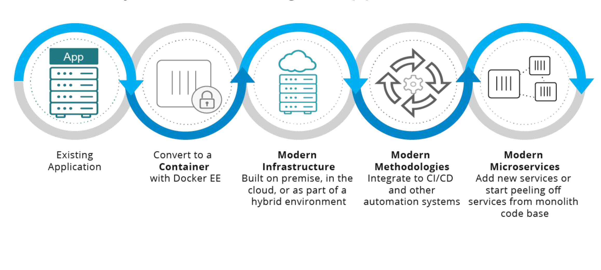

# Part 3: Microservices

## Microservices

So you might be thinking, wow Docker is a really useful tool! But not everything is suited to use a Docker environment. Docker really comes into its element when you have a microservice-based system. 

Microservice architecture is where your software is intrinsically designed as small modular processes. It is is a method of developing software applications as a suite of independently deployable, small, modular services in which each service runs a unique process. This means that applications can be deployed and managed dynamically. This ensures agile development in creating and deploying apps, and increase in ease and efficiency for developers.

It also keeps environmental consistency – your application will run the same on a laptop as it does in the cloud. This links to agile practices such as Continuous Integration & Continuous Delivery, and is useful when using automation platforms such as Hudson or Jenkins which are also open source!

If your application has a lot of low-level system calls or needs hardware access, then Docker isn’t the platform for you.

For more information on Monolithic vs Microservice architecture click [here](https://www.bmc.com/blogs/microservices-architecture/).

Continue to [Part 4](Part4.md)