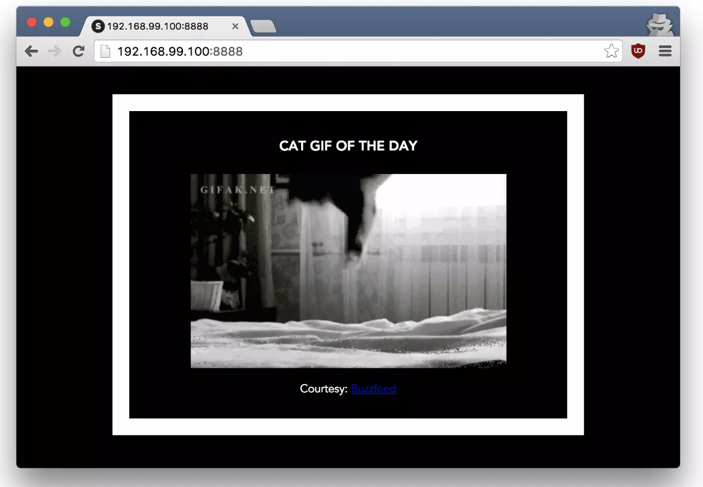

# Part 7: Creating a Dockerfile & Image

### Our First Image

Now that we have a better understanding of images, it's time to create our own. Our goal in this section will be to create an image that sandboxes a simple Flask application. Flask is a micro web framework written in Python.

For the purposes of this workshop, we're going to use a premade Flask app that displays a random cat .gif every time it is loaded.

Go ahead and clone the repository locally like so:

```bash
$ git clone https://github.com/prakhar1989/docker-curriculum
$ cd docker-curriculum/flask-app
```
> _This should be cloned on the machine where you are running the docker commands and not inside a docker container._

The next step now is to create an image with this web app. As mentioned above, all user images are based off of a base image. Since our application is written in Python, the base image we're going to use will be [Python 3](https://hub.docker.com/_/python/). More specifically, we are going to use the `python:3-onbuild` version of the python image.

The `onbuild` version of the image includes helpers that automate the boring parts of getting an app running. Rather than doing these tasks manually (or scripting these tasks), these images do that work for you. 

We now have all the ingredients to create our own image - a functioning web app and a base image. How are we going to do that? The answer is - using a Dockerfile.

### Dockerfile

A [Dockerfile](https://docs.docker.com/engine/reference/builder/) is a simple text-file that contains a list of commands that the Docker client calls while creating an image. It's a simple way to automate the image creation process. The best part is that the [commands](https://docs.docker.com/engine/reference/builder/#from) you write in a Dockerfile are almost identical to their equivalent Linux commands. This means you don't really have to learn new syntax to create your own dockerfiles.

The application directory does contain a Dockerfile but since we're doing this for the first time, we'll create one from scratch. To start, create a new blank file in our favorite text-editor and save it in the same folder as the flask app by the name of `Dockerfile.`

We start with specifying our base image. Use the `FROM` keyword to do that -

```vim
FROM python:3-onbuild
```

The next step usually is to write the commands of copying the files and installing the dependencies. Luckily for us, the `onbuild` version of the image takes care of that. The next thing we need to specify is the port number that needs to be exposed. Since our flask app is running on port `5000`, that's what we'll indicate.

```vim
EXPOSE 5000
```

The last step is to write the command for running the application, which is simply `- python ./app.py`. We use the `CMD` command to do that:

```vim
CMD ["python", "./app.py"]
```

The primary purpose of `CMD` is to tell the container which command it should run when it is started. With that, our `Dockerfile` is now ready. This is how it looks like:

```vim
# our base image
FROM python:3-onbuild

# specify the port number the container should expose
EXPOSE 5000

# run the application
CMD ["python", "./app.py"]
```

Now that we have our `Dockerfile`, we can build our image. The `docker build` command does the heavy-lifting of creating a Docker image from a `Dockerfile`.

The section below shows you the output of running the same. Before you run the command yourself, make sure to replace the username with yours. This `username` should be the same one you created when you registered on [Docker hub](https://hub.docker.com/). If you haven't done that yet, please go ahead and create an account. The `docker build` command is quite simple - it takes an optional tag name with `-t` and a location of the directory containing the `Dockerfile`.


We may need to use `docker login` here to login to your Docker account.

```bash
docker build -t <username>/catnip .
```


```bash
$ docker build -t prakhar1989/catnip .
Sending build context to Docker daemon 8.704 kB
Step 1 : FROM python:3-onbuild
# Executing 3 build triggers...
Step 1 : COPY requirements.txt /usr/src/app/
 ---> Using cache
Step 1 : RUN pip install --no-cache-dir -r requirements.txt
 ---> Using cache
Step 1 : COPY . /usr/src/app
 ---> 1d61f639ef9e
Removing intermediate container 4de6ddf5528c
Step 2 : EXPOSE 5000
 ---> Running in 12cfcf6d67ee
 ---> f423c2f179d1
Removing intermediate container 12cfcf6d67ee
Step 3 : CMD python ./app.py
 ---> Running in f01401a5ace9
 ---> 13e87ed1fbc2
Removing intermediate container f01401a5ace9
Successfully built 13e87ed1fbc2
```

If you don't have the `python:3-onbuild` image, the client will first pull the image and then create your image. Hence, your output from running the command will look different from the above. Look carefully and you'll notice that the on-build triggers were executed correctly. If everything went well, your image should be ready! Run `docker images` and see if your image shows.

The last step in this section is to run the image and see if it actually works (replacing the username with yours).

```bash
$ docker run -p 8888:5000 prakhar1989/catnip
 * Running on http://0.0.0.0:5000/ (Press CTRL+C to quit)
 ```

 The command we just ran used port 5000 for the server inside the container, and exposed this externally on port 8888. Head over to the URL with port 8888, where your app should be live.



 Congratulations! You have successfully created your first docker image.

Continue to [Part 8](ContainerSecurity.md)
