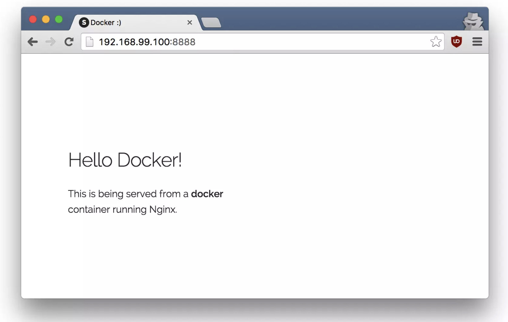

# Part 6: Webapps & Docker

### Workshop 2: Containerize a Webapp

Great! So we have now looked at `docker run`, played with a Docker container and also got a hang of some terminology. Armed with all this knowledge, we are now ready to get to the real-stuff, i.e. deploying web applications with Docker!

Here we're going to create our own Dockerfile.

#### Static Sites:

The first thing we're going to look at is how we can run a dead-simple static website. We're going to pull a Docker image from Docker Hub, run the container and see how easy it is to run a webserver.

The image that we are going to use is a single-page website that has already been created for the purpose of this demo and hosted on the registry - `prakhar1989/static-site`. We can download and run the image directly in one go using docker run. Note: the `--rm` flag automatically removes the container when it exits.

```bash
$ docker run --rm prakhar1989/static-site
```

Since the image doesn't exist locally, the client will first fetch the image from the registry and then run the image. If all goes well, you should see a `Nginx is running...` message in your terminal.

How can we see the website? What port is it running on? And more importantly, how do we access the container directly from our host machine? Hit `Ctrl+C` to stop the container. 

This is where we have to talk about Container Networking. By default, when you create a container, it does not publish any of its ports to the outside world. To make a port available to services outside of Docker, or to Docker containers which are not connected to the container’s network, use the --publish or -p flag. This allows traffic to flow from the container to the outside world.

Well in our case, the client is not exposing any ports so we need to re-run the `docker run` command to publish ports. While we're at it, we should also find a way so that our terminal is not attached to the running container. This way, you can happily close your terminal and keep the container running. This is called __detached__ mode.

```bash
$ docker run -d -P --name static-site prakhar1989/static-site
e61d12292d69556eabe2a44c16cbd54486b2527e2ce4f95438e504afb7b02810
```

In the above command, `-d` will detach our terminal, `-P` will publish all exposed ports to random ports and finally `--name` corresponds to a name we want to give. Now we can see the ports by running the `docker port [CONTAINER]` command.

```bash
$ docker port static-site
80/tcp -> 0.0.0.0:32769
443/tcp -> 0.0.0.0:32768
```

You can open http://localhost:32769 in your browser to see the site!

You can also specify a custom port to which the client will forward connections to the container.

```bash
$ docker run -p 8888:80 prakhar1989/static-site
Nginx is running...
```


To stop a detached container, run `docker stop` by giving the container ID. In this case, we can use the name `static-site` we used to start the container.

```bash
$ docker stop static-site
static-site
```

To deploy this on a real server you would just need to install Docker, and run the above Docker command. Now that you've seen how to run a webserver inside a Docker image, you must be wondering - how do I create my own Docker image? This is the question we'll be exploring in the next section.

#### Docker Images

We've looked at images before, but in this section we'll dive deeper into what Docker images are and build our own image! Lastly, we'll also use that image to run our application locally and finally deploy on Docker Hub to share! Let's get started.


Docker images are the basis of containers. In the previous example, we __pulled__ the _Busybox_ image from the registry and asked the Docker client to run a container based on that image. To see the list of images that are available locally, use the `docker images` command.

```bash
$ docker images
REPOSITORY                      TAG                 IMAGE ID            CREATED             VIRTUAL SIZE
prakhar1989/catnip              latest              c7ffb5626a50        2 hours ago         697.9 MB
prakhar1989/static-site         latest              b270625a1631        21 hours ago        133.9 MB
python                          3-onbuild           cf4002b2c383        5 days ago          688.8 MB
martin/docker-cleanup-volumes   latest              b42990daaca2        7 weeks ago         22.14 MB
ubuntu                          latest              e9ae3c220b23        7 weeks ago         187.9 MB
busybox                         latest              c51f86c28340        9 weeks ago         1.109 MB
```

The above gives a list of images that I've pulled from the registry. The `TAG` refers to a particular snapshot of the image and the `IMAGE ID` is the corresponding unique identifier for that image.

For simplicity, you can think of an image similar to a git repository - images can be committed with changes and have multiple versions. If you don't provide a specific version number, the client defaults to latest. For example, you can pull a specific version of ubuntu image.

```bash
$ docker pull ubuntu:12.04
```

To get a new Docker image you can either get it from a registry (such as the Docker Hub) or create your own. There are tens of thousands of images available on Docker Hub. You can also search for images directly from the command line using `docker search`.

An important distinction to be aware of when it comes to images is the difference between base and child images.

* ___Base images___ are images that have no parent image, usually images with an OS like `ubuntu`, `busybox` or `debian`.

* ___Child images___ are images that build on base images and add additional functionality.

Then there are official and user images, which can be both base and child images.

* ___Official images___ are images that are officially maintained and supported by the folks at Docker. These are typically one word long. In the list of images above, the `python`, `ubuntu`, `busybox` and `hello-world` images are official images.

* ___User images___ are images created and shared by users like you and me. They build on base images and add additional functionality. Typically, these are formatted as `user/image-name`.

Continue to [Part 7](Dockerfiles.md)

