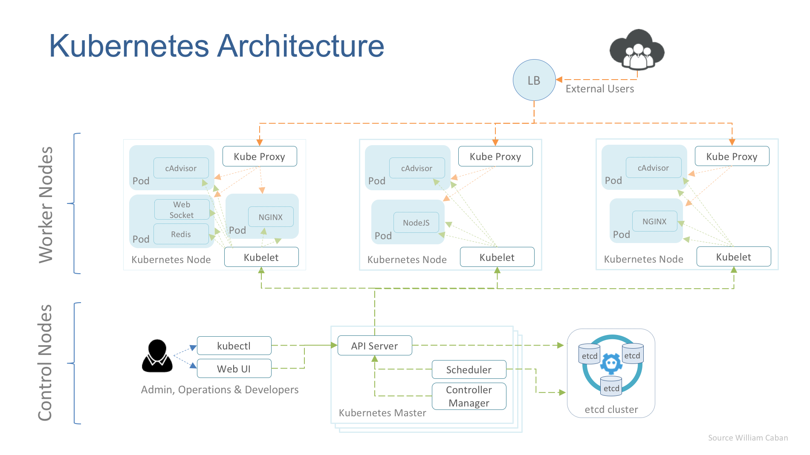

# Part 5: Kubernetes Architecture

We're now going to go through a few concepts about the Kubernetes architecture which we have brushed over previously.

Kubernetes is composed of primitives, we have previously learned about:

- Pods - collections of containers which share the same IP address
- Nodes - machines on which multiple pods may live
- Clusters - collections of nodes
- Services - enable access to the previous three objects
- Deployments - enable creation of Pods and ReplicaSets

#### Kubectl

In order to interact with these objects you must be able to communicate with the Kubernetes API. The typical way
to interact with the API is by using the command-line interface **kubectl**. 

#### Kubernetes Control Plane

The Control Plane is a collection of continuously running process which make sure the state of the cluster is always correct.

One of the components is the Kubernetes Master, we have previously said that this runs a single node of the cluster, that is the master node.
The Kubernetes master is composed out of three processes:
- kube-apiserver - validates and configures data for the API objects
- kube controller-manager - a daemon which regulates the state of the system
- kube-scheduler - a function in charge of scheduling pods and other objects based on various rules

Every other node in the cluster runs two processes:
- kubelet:
    - communicates with the Kubernetes Master
    - it consumes a PodSpec, a yaml or json object describing a pod
    - it ensures that the containers described in the specification are running and healthy
- kube-proxy - a network proxy which reflects Kubernetes networking services on each node

#### KubeDNS

The Kubernetes DNS service creates a DNS Pod and Service on the cluster in order for each individual container to tbe able
to resolve DNS names by using the DNS Service's IP address.

#### etcd

etcd is a key value store which Kubernetes uses to store all cluster data. In the case of cluster failure the data will be lost, but
you can set up a backing plan for the data.

Continue to [Part 6](YamlFiles.md)
